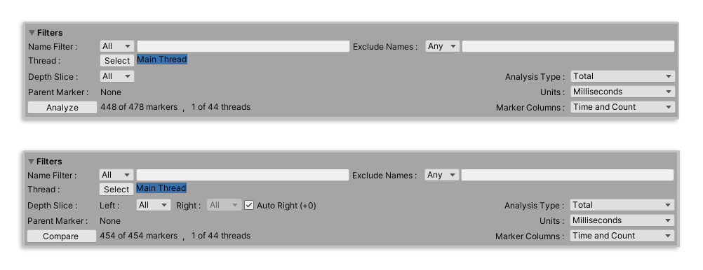
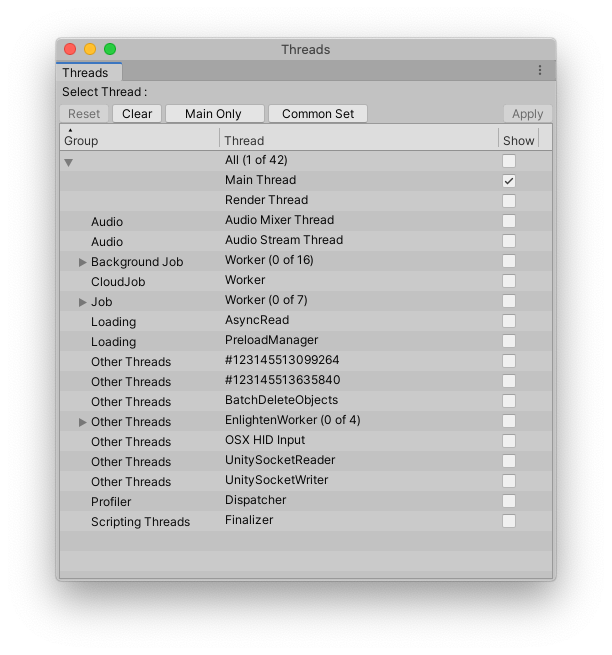
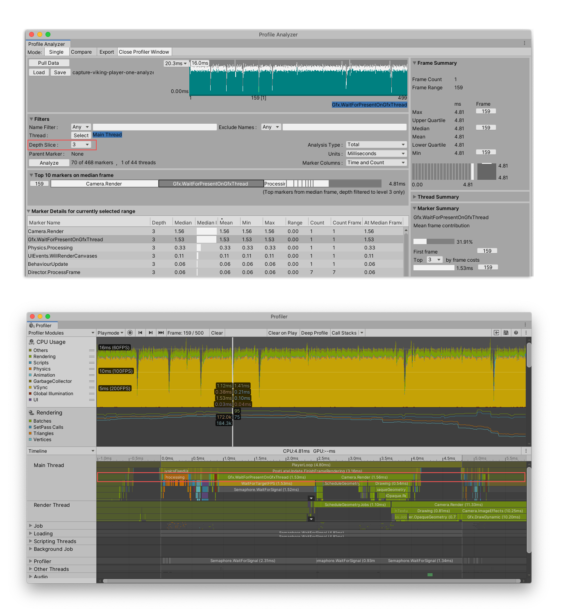
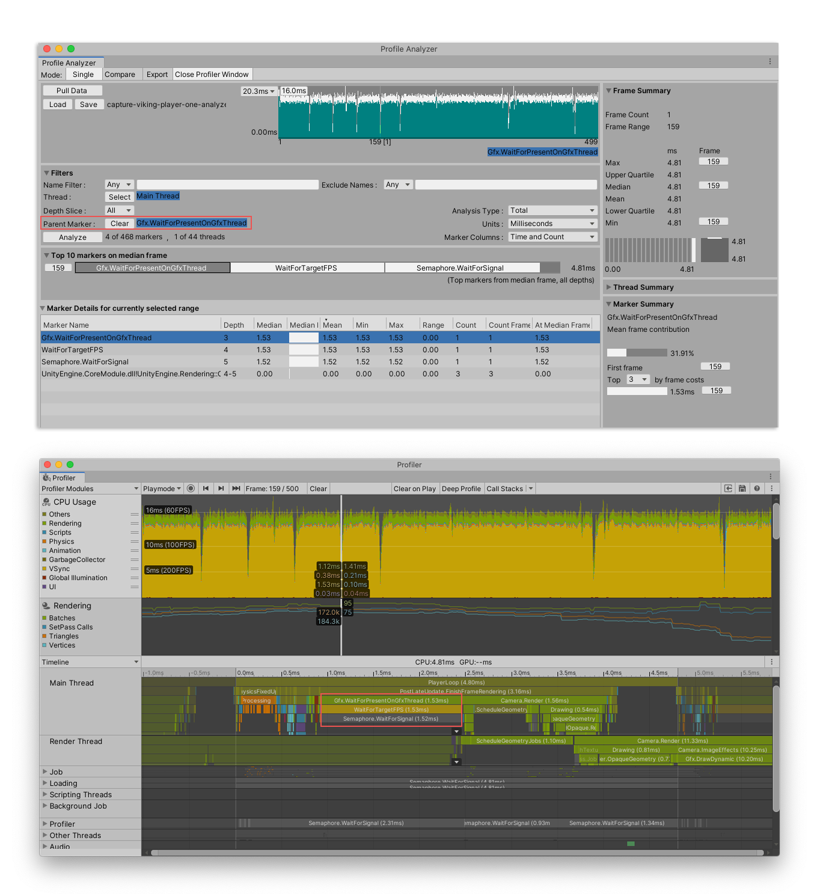

# Filters pane

You can use the **Filters** pane in the [Single](single-view.md) and [Compare](compare-view.md) view to reduce and filter the working data set. You can limit the data set by filters such as partial marker name match, a specific thread, or a specific stack level. As well as filtering by match, you can set the filter to exclude any markers by name. This is particularly useful to exclude markers the might distort the view, or aren't statistically relevant.

 *Single view Filters pane (above) and Compare view Filters pane (below). Note the addition of further Depth Slice controls in the Compare view.* 

The pane has the following controls:

|**Control**|**Function**|
|---|---|
|**Name Filter**|Enter the name of a marker you would like to filter the data set by. Once you start typing, the Profile Analyzer automatically filters the **Marker details** pane to display the matching markers. You can also right click on a marker in the **Marker details** pane and select **Add to Include Filter** to add it to the filter. To include a marker name with a space, surround it in quotation marks     Choose **Any** from the dropdown to match any of the terms to the markers in the list. Select **All** from the dropdown to match all of the listed terms to the markers in the list.|
|**Exclude Names**|Enter the name of a marker you would like to exclude from the data set. Once you start typing, the Profile Analyzer automatically filters the **Marker details** pane to display the matching markers. You can also right click on a marker in the **Marker details** pane and select **Add to Exclude Filter** to exclude it from the filter.    Select **Any** from the dropdown to match any of the terms to the markers in the list. Select **All** from the dropdown to match all of the listed terms to the markers in the list.|
|**Thread**|Select which thread or threads to filter the data set by. Click the **Select** button to open the **Thread** window and filter the data set further. For more information, see the [Thread window](#thread-window) section of this page.|
|**Depth Slice**|Set the depth level of the [Hierarchy](https://docs.unity3d.com/Manual/ProfilerCPU.html#hierarchy) to display. The **Marker Details/Comparison** view then displays all the markers on this level only. In the **Compare** view, the **Auto Right** checkbox is enabled by default, which automatically aligns the depth of the two data sets. For more information, see the [Depth Slice](#depth-slice) section of this page. |
|**Parent Marker**|Displays the parent marker the data set is filtered by. To filter by a parent marker, right click on it in the **Marker Details/Comparison** list and then select **Set As Parent Marker Filter**. For more information, see the [Parent Marker](#parent-marker) section of this page.|
|**Analyze** (Single view) **Compare** (Compare view)|Contains details of the number of markers and threads in the data set. **Note:** The button is redundant, because the Profile Analyzer automatically updates the marker pane with the filters you set. However, you can hover on the button to see timings of the analysis or comparison.|
|**Analysis type**|Select what times the Profile Analyzer includes in its analysis, from either **Total** or **self**. The **Total** option sets the marker times to inclusive, which means the time spent in the marker and its children is included in the filter. The **Self** option sets the marker times to exclusive, which means that the the time in the marker's children is excluded from the filter. |
|**Units**|Select the unit of measurement of time to display in the Profile Analyzer. Choose between **Milliseconds** (default) or **Microseconds**.   **Note:** If you select **Microseconds**, the Profile Analyzer displays larger timings in milliseconds.|
|**Marker Columns**|Select a layout for the **Marker Details/Comparison** pane. For more information on the columns in this pane, see the documentation on [Single view Marker Details list](single-view.html#marker-details-list) and [Compare view Marker Comparison list](compare-view.html#marker-comparison-list).|

## Thread window

By default, the Profile Analyzer displays the markers on the main thread in the **Marker Details/Comparison** pane. To analyze the markers on other threads, under **Threads**, click the **Select** button, and the Threads window opens.

 *The Thread window*

To add more threads to the analysis, enable the checkboxes next to their names, then click the **Apply** button. The Profile Analyzer then updates the data set. There are two pre-defined sets of threads: **Main Only** and **Common Set**. **Main Only** selects just the Main Thread, and the **Common Set** selects the Main Thread, plus the Render and Jobs threads.

Click the **Clear** button to clear all of the threads you've selected, and **Reset** to reset the selection back to the previous thread set. 

## Depth Slice

When you select a **Depth Slice** level in the dropdown, it corresponds to the level of the marker within the hierarchy of the thread. You can visualize this in the Profiler window as follows:

 *Top, the Profile Analyzer in the Single view with a Depth Slice of 3 selected in the Filters pane. Bottom, the Profiler window with the CPU Usage module selected, in Timeline view. Note that the markers in the Marker Details list correspond to the markers in the third level of the Main Thread's hierarchy.*

In the Compare view, the Profile Analyzer automatically aligns the depth of the two data sets so that the top level markers are aligned correctly. The value of the offset is displayed in brackets after the **Auto Right** checkbox.

To override the automatic depth alignment, disable the **Auto Right** checkbox and then manually set the depth levels for the left (blue) and right (orange) sets. This is useful if you're comparing data sets from different versions of Unity. 

## Parent Marker

To filter the dataset by a specific marker and its children, right click on the marker in the **Marker Details/Comparison** pane and then select **Set As Parent Marker Filter**. You can visualize this in the Profiler window as follows: 

  *Top, the Profile Analyzer in the Single view with the data filtered by the parent marker of Gfx.WaitForPresentOnGfxThread. Bottom, the same frame opened in the Profiler window, with this thread highlighted. Note that the markers in the Timeline view correspond to those filtered in the Profile Analyzer.*