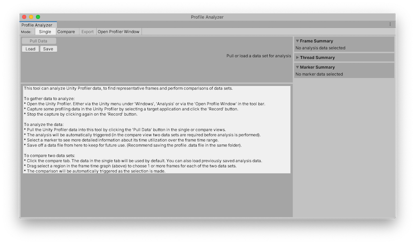
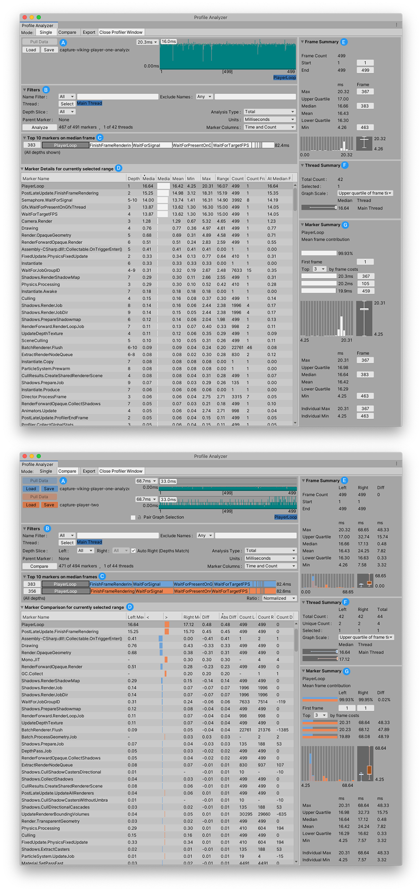
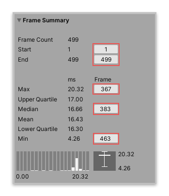

# Profile Analyzer window

The Profile Analyzer window visualizes frame, thread, and marker data from the [Unity Profiler](https://docs.unity3d.com/Manual/Profiler.html) window. You can use it to analyze the performance of specific markers, threads, and frames.

To open the Profile Analyzer window, in the Unity Editor go to menu: **Window &gt; Analysis &gt; Profile Analyzer**.

 *The Profile Analyzer window on start up, with no data loaded.*

The Profile Analyzer has two views:

* **Single:** The [Single view](single-view.md) displays one set of Profiler data. You can use this view to analyze specific events on one set of profiling data.
* **Compare:** In the [Compare view](compare-view.md), you can load two sets of Profiler data to compare. You can use the Compare view to compare two different sets of profiling data, or to compare different events in the same data set.

In both views, the Profile Analyzer displays min, max, median, mean, and lower/upper quartile values of the selected frame range. It also displays information on the distribution of each profiler marker in histograms and box and whisker plots.

## Pulling and analyzing performance data

The Profile Analyzer only analyzes CPU data. It can either analyze data from the active set of frames loaded into the Profiler, or from a saved Profile Analyzer .pdata file.

The Profile Analyzer aggregates the activity of each marker, and generates useful statistics to help you analyze the marker costs over a number of threads and frames. This includes summing the runtime and counts of each occurrence of every marker for all active threads and frames the Profile captured.

### Pulling data from the Profiler window

To pull data from an active profiling session, click the **Pull Data** button. This pulls in the current set of available frames from the Profiler and visualizes the analyzed results.

If you don't have an active profile session, click the **Open Profiler Window** button, then load or record some data.

### Loading and saving a data set

You can save or reload any data that the Profile Analyzer analyzes at any point in time. This means you can share your analysis with others and load the results into the **Single** or **Compare** view at any time. To save the data from the Profile Analyzer, click the **Save** button in any view. This saves the data in the .pdata format. To load this data, click the **Load** button in any view.

>[!NOTE]
>If you select the **Load** option, the data must be in the Profile Analyzer .pdata format. If you have data from the Profiler in the .data file format, open it in the Profiler first, and then select the **Pull Data** button in the Profile Analyzer.

For more information on how to pull data into the Profile Analyzer, see the workflow documentation on [Collecting and viewing data](collecting-and-viewing-data.md).

## Window navigation

The controls and navigation for the Profile Analyzer window are very similar in both the Single and Compare view.

The Profile Analyzer window has the following controls across both views, which you can access at the top of the window:

|**Control**|**Function**|
|---|---|
|**Single**|Enter the [Single view](single-view.md) mode. This is the default view mode.|
|**Compare**|Enter the [Compare view](compare-view.md) mode. You can compare two sets of profiling data in this mode.|
|**Export**|Export the data into a .csv format. When you click this button, a dialog box opens and you can choose from:  **Marker table:** Exports the marker data visible in [Single view](single-view.md) **Single Frame Times:** Exports the frame data visible in the Single view **Comparison Frame Times:** Exports both sets of data visible in the [Compare view](compare-view.md).  This button is disabled if you haven't imported any data into the Profile Analyzer window.|
|**Open Profiler Window**|Click this button to open the [Profiler window](https://docs.unity3d.com/Manual/ProfilerWindow.html). When the Profiler window is open, this button changes to **Close Profiler Window**.|

When you load some data into the Profile Analyzer window, the window populates with the profiling data, and is laid out as follows:

 *The Profile Analyzer window in Single view (top), and Compare view (bottom).*

|Pane|Description|
|---|---|
|**A:** Frame control| Displays individual frame timings, ordered by frame index or frame duration. You can also use this pane to select a range of frames for the Profile Analyzer to analyze. For more information on this pane, see the [Frame control](frame-range-selection.md) documentation.    In Compare View, to select the same range on both sets of data, enable **Pair Graph Selection** underneath the charts and then click and drag a selection on either of the charts. For more information on this pane, see the [Frame control](frame-range-selection.md) documentation.|
|**B:** Filters| Use the filter pane to limit the data that the Profile Analyzer displays. You can filter by partial match name, thread, or depth slice. You can also exclude markers to remove any markers that aren't relevant from the filtered view. For more information on how to use the filter pane, see the [Filter](filtering-system.md) documentation.|
|**C:** Top 10 markers on median frame(s)| Visualizes the ten highest duration markers that contributed to the frame. In Compare view, this shows the ten highest markers for both sets of data. You can select any of the markers in this pane to see more information on them. The Profile Analyzer reflects changes you make to the Depth filter in this pane.  In Compare view, to adjust how the Profile Analyzer draws the markers against each other, use the **Ratio** dropdown.  **Normalised** displays the two data sets relative to their own time at the selected depth.  **Longest** displays the absolute difference between the two sets at the selected depth.|
|**D:** Marker details for currently selected range *(Single view)* Marker Comparison for currently selected range *(Compare view)*| A sortable list of markers, with detailed information on their timings. For more information on the particular statistics available in these panes, see the documentation on [Single view marker details list](single-view.html#marker-details-list) and [Compare view Marker Comparison list](compare-view.html#marker-comparison-list).|
|**E:** Frame summary| Displays a summary of frame times. For more information on this pane, see the documentation on [Frame Summary](frame-summary.md).|
|**F:** Thread summary|Displays information about the threads in the data set. For more information, see the documentation on the [Thread Summary pane](thread-summary.md).|
|**G:** Marker summary| Summarizes the marker data of the current selected item in the **Marker Details** list. For more information, see the [Marker summary](marker-summary.md) documentation.|

### Frame buttons

If the data you analyze in the Profile Analyzer is also loaded into the Profiler window, you can click on the frame buttons in the Profile Analyzer window to jump to the relevant frames in the Profiler.

 *The Frame Summary pane with the frame buttons highlighted.*

## Frame range selection

You can limit the analysis to a subset or selection of frames. To do this, you can click and drag on the chart in the Frame Control pane at the top of the **Single** and **Compare** views and select a range, or use the context menu commands to select a range. For more information on using the frame range pane, see the [Frame Control pane](frame-range-selection.md) documentation.

## Filtering

You can also filter the data to limit the number of markers the Profile Analyzer displays. This includes filtering by thread, call depth and name substrings. You can order the remaining markers by any of the available metrics in the marker list control. For more information on how to use the filter system, see the [Filters pane](filtering-system.md) documentation.
